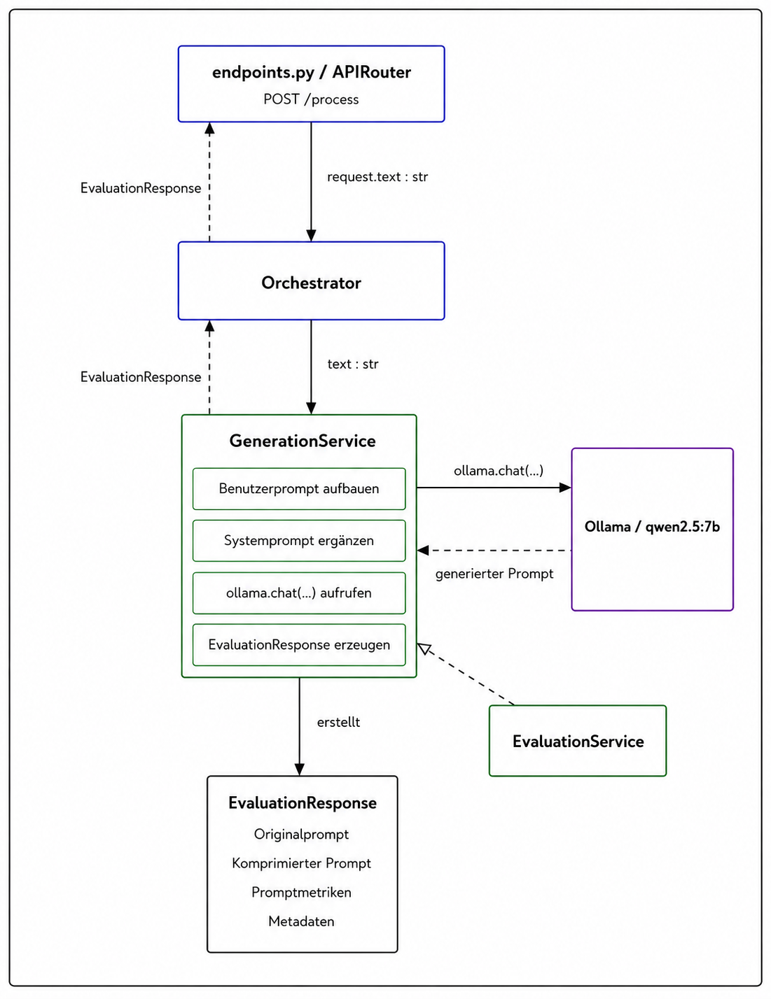

# Prompt Shortening Tool

A web application developed as part of my **Bachelor's thesis** for shortening and evaluating prompts with local language models via **Ollama**.

## Prerequisites

Before starting the application, make sure the following are installed:

- Python
- Node.js / npm
- Ollama

## Setup

### 1. Install Python dependencies

Run the following command from the project root:

```bash
python -m pip install -r requirements.txt
```

### 2. Install required models

Install the required Ollama and spaCy models with:

```bash
python setup_models.py
```

## Startup

The backend, frontend, and the Ollama initialization can be started together using the existing VS Code configuration.

### Option 1: Run Task

1. Open the VS Code Command Palette with `Ctrl + Shift + P`.
2. Select **Tasks: Run Task**.
3. Select **Start Full Stack**.

### Option 2: Run and Debug

1. Open the **Run and Debug** tab with `Ctrl + Shift + D`.
2. Start debugging with `F5`.

The **Start Full Stack** task starts the required application components automatically.

## Backend Architecture

The backend contains several modules and services. For the main part of the thesis, the most relevant components are the **FullGen / Generation Service** and the **Evaluation Service**. The API layer and orchestrator mainly provide the surrounding request flow and coordinate these services.



### Core Processing Flow

1. The API endpoint receives a request via `POST /process` and forwards the input text to the **Orchestrator**.
2. The **Orchestrator** delegates the text to the **Generation Service**.
3. The **Generation Service** builds the user prompt, enriches it with the system prompt, and sends the resulting request to the configured Ollama model.
4. Ollama generates the shortened prompt and returns it to the **Generation Service**.
5. The **Evaluation Service** supplies the evaluation logic used to assess the generated result.
6. The results are combined into an **EvaluationResponse**, containing the original prompt, compressed prompt, prompt metrics, and metadata.
7. The response is returned through the orchestrator to the API endpoint.

### Thesis-Relevant Components

#### FullGen / Generation Service

The **Generation Service** contains the central prompt-generation logic and is therefore one of the primary components considered in the thesis. Its responsibilities include:

- building the user prompt,
- adding the system prompt,
- invoking the Ollama model,
- processing the generated prompt, and
- creating the final `EvaluationResponse`.

The current setup uses Ollama with the model shown in the architecture diagram (`qwen2.5:7b`).

#### Evaluation Service

The **Evaluation Service** provides the evaluation functionality used to assess and enrich the generated result. Its output contributes to the prompt metrics and metadata contained in the final `EvaluationResponse`.

### Supporting Components

The following components are required for the application flow but are not the primary focus of the thesis:

- **API Router / `endpoints.py`** – exposes the `/process` endpoint and returns the response to the client.
- **Orchestrator** – coordinates the processing flow between the API and the underlying services.
- **Ollama** – provides the locally executed language model used for prompt generation.
- **EvaluationResponse** – represents the combined output returned by the backend.
